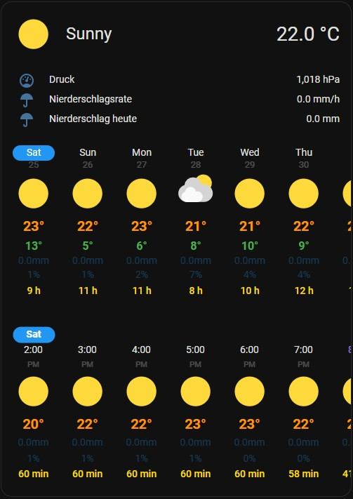

# Detailed Weather Forecast Card





## Overview

Detailed Weather Forecast is a Lovelace custom card for Home Assistant that combines a large weather header with interactive daily and hourly forecasts. The card displays the forecast from the selected `weather` entity, and adds visual context such as sunrise and sunset markers, precipitation values, and day or night specific artwork or animations.

This card is a further development of the [Weather Forecast Extended Card](https://github.com/Thyraz/weather-forecast-extended) and was also inspired by the [Weather Forecast Card](https://github.com/troinine/ha-weather-forecast-card). The card was primarily developed for my own dashboard, but can of course also be used by other users. The main requirement for this card was a compact view, which nevertheless gives you the opportunity to see all available information about the current weather and the weather forecast via interaction.

## Features

- Header area that shows the current condition and temperature with either an animated background or day and night background artwork.
- Daily and hourly forecast sections that can be shown together or independently.
- Optional sunrise and sunset times embedded in the hourly forecast, using either the Home Assistant location or custom coordinates for sun calculations.
- Support to display daily / hourly solar forecast.
- Optional minute-level nowcast precipitation chart via `get_minute_forecast` actions (OpenWeatherMap, DWD nowcast).
- Configurable header chips that can display weather entity attributes or other entities in the header.
- Optional tap actions and icons on the header pills / chips.
- Support for 12 or 24 hour time formats and localized date labels using the Home Assistant user settings.
- UI card editor

## Installation

### HACS (recommended)

1. In Home Assistant, open _HACS > Frontend_ and click the three-dot menu in the top right.
2. Choose _Custom repositories_, add `https://github.com/tobiasb80/detailed-weather-forecast`, and set the category to _Dashboard_.
3. Search for "Detailed Weather Forecast Card" in HACS, install the latest release, and let HACS add the resource to your dashboard automatically.
4. Reload the browser or clear the Lovelace cache if the new card type is not immediately available.

## Usage

Once the resource is installed, add a new card in the Lovelace dashboard editor and search for **Detailed Weather Forecast**. The visual editor exposes every option listed below. You can also configure the card in YAML:

```yaml
type: custom:detailed-weather-forecast-card
entity: weather.home
```

### Extended example

```yaml
type: custom:detailed-weather-forecast-card
entity: weather.home
show_header: true
show_background: true
compact_header_chips: true
hourly_forecast: true
daily_forecast: true
use_night_header_backgrounds: true
header_info:
  - type: attribute
    attribute: pressure
  - type: entity
    entity: sensor.precipitation_today
daily_info:
  - attribute: humidity
hourly_info:
  - attribute: cloud_coverage
nowcast_always_show: true
show_animation: true
header_chips:
  - type: attribute
    attribute: humidity
  - type: entity
    entity: sensor.precipitation_rate
show_sun_times: true
sun_use_home_coordinates: false
sun_latitude: '48.137'
sun_longitude: '11.575'
icon_map:
  clear-night: wi:clear-night
moon_phase_entity: sensor.moon_phase
nowcast_entity: weather.nowcast
header_temperature:
  entity: sensor.outdoor_temperature
  tap_action:
    action: more-info
daily_extra_attribute:
  attribute: cloud_coverage
hourly_extra_attribute:
  attribute: visibility
```

## Configuration options

| Option                         | Type             | Default                                 | Description                                                                                                                                                                            |
| ------------------------------ | ---------------- | --------------------------------------- | -------------------------------------------------------------------------------------------------------------------------------------------------------------------------------------- |
| `type`                         | string           | `custom:detailed-weather-forecast-card` | Lovelace card type identifier.                                                                                                                                                         |
| `entity`                       | string           | required                                | Weather entity that supplies current conditions and forecast data.                                                                                                                     |
| `nowcast_entity`               | string           | none                                    | Weather entity that supports `get_minute_forecast` and provides minute-level precipitation.                                                                                            |
| `nowcast_always_show`          | boolean          | `false`                                 | When enabled, the nowcast chart stays visible even if no rain is predicted. Useful to keep the header layout consistent.                                                               |
| `show_header`                  | boolean          | `true`                                  | Toggles hero header containing artwork, current temperature, and condition text.                                                                                                       |
| `show_background`              | boolean          | `false`                                 | Toggles the background image in the header.                                                                                                                                            |
| `hourly_forecast`              | boolean          | `true`                                  | Shows the hourly forecast. Requires the selected weather entity to provide hourly data.                                                                                                |
| `daily_forecast`               | boolean          | `true`                                  | Shows the daily forecast.                                                                                                                                                              |
| `daily_min_gap`                | number           | `30`                                    | Minimum gap in pixels between daily forecast items. Must be `≥ 10`.                                                                                                                    |
| `hourly_min_gap`               | number           | `16`                                    | Minimum gap in pixels between hourly forecast items. Must be `≥ 10`.                                                                                                                   |
| `daily_icon_size`              | number           | `60`                                    | Size of the weather icons in the daily forecast in pixels. Must be `≥ 20`.                                                                                                             |
| `hourly_icon_size`             | number           | `60`                                    | Size of the weather icons in the hourly forecast in pixels. Must be `≥ 20`.                                                                                                            |
| `show_sun_times`               | boolean          | `false`                                 | Adds sunrise and sunset markers to the hourly forecast. Requires valid coordinates.                                                                                                    |
| `sun_use_home_coordinates`     | boolean          | `true`                                  | Uses Home Assistant's home location for sun calculations when `show_sun_times` is enabled. Set to `false` to provide manual coordinates.                                               |
| `sun_latitude`                 | number \| string | Home Assistant latitude                 | Latitude used when `sun_use_home_coordinates` is `false`. Accepts decimal degrees as string or number.                                                                                 |
| `sun_longitude`                | number \| string | Home Assistant longitude                | Longitude used when `sun_use_home_coordinates` is `false`. Accepts decimal degrees as string or number.                                                                                |
| `compact_header_chips`         | boolean          | `false`                                 | Uses a compact pill design for header chips.                                                                                                                                           |
| `use_night_header_backgrounds` | boolean          | `true`                                  | Switches the header artwork to night variants when the sun is down. Set to `false` to always use the day theme.                                                                        |
| `show_animation`               | boolean          | `false`                                 | Shows a weather animation in the header.                                                                                                                                               |
| `moon_phase_entity`            | string           | none                                    | Optional sensor entity to display the current moon phase.                                                                                                                              |
| `icon_map`                     | object           | none                                    | Optional overrides for forecast condition icons. Keys are weather conditions, values are Home Assistant icon names (including custom icon sets).                                       |
| `header_temperature`           | object           | none                                    | Configuration for the header temperature pill including `entity`, `tap_action`, `hold_action` and `double_tap_action`.                                                                 |
| `header_condition`             | object           | none                                    | Configuration for the header condition pill including `tap_action`, `hold_action` and `double_tap_action`.                                                                             |
| `hourly_extra_attribute`       | object           | none                                    | Optional third text line under the hourly precipitation rows. Includes `attribute`, `unit`, `divisor`, `color`, and `dim_below`.                                                       |
| `daily_extra_attribute`        | object           | none                                    | Optional third text line under the daily precipitation rows. Includes `attribute`, `unit`, `divisor`, `color`, and `dim_below`.                                                        |
| `header_chips`                 | array            | `[]`                                    | Up to three chip definitions shown in the header. Each chip can display an entity attribute or another entity's state and may include its own `icon` and `tap_action`.                 |
| `header_info`                  | array            | `[]`                                    | A list of attribute objects to show in the expandable detail view for the current weather conditions.                                                                                  |
| `daily_info`                   | array            | `[]`                                    | A list of attribute objects to show in the expandable detail view for each daily forecast item.                                                                                        |
| `hourly_info`                  | array            | `[]`                                    | A list of attribute objects to show in the expandable detail view for each hourly forecast item.                                                                                       |
| `solar_forecast_entries`       | array            | all Energy solar forecasts              | Optional list of config entry IDs to include when `solar_forecast` is selected as an extra attribute. Leave empty to include none, or omit to include all Energy dashboard selections. |
| `masonry_rows`                 | number           | none                                    | Masonry layout only: override the card height (1 row is handled as 50px by HA). Ignored in Sections view.                                                                              |
| `animation_background_colors`  | object           | none                                    | Optional overrides for the background gradient colors (e.g. `day-gradient-start`, `night-gradient-end`).                                                                               |

> Tip: The card editor prevents you from hiding every section at once, but in YAML you should also keep at least one of `show_header`, `daily_forecast`, or `hourly_forecast` enabled so the card has content to render.

### Header Chips & Expandable Info

You can display additional weather details or sensor states in the header area using two different methods: **Header Chips** and **Header Info**.

- **Header Chips (`header_chips`)**: Small, pill-shaped indicators that are **always visible** above the current temperature. You can configure up to three chips.
- **Header Info (`header_info`)**: An expandable list of attributes that is **hidden by default**. It becomes visible only when a user clicks on the weather condition text in the header.
  > **⚠️ Warning**: If you override the default tap action of the condition text (using `header_condition.tap_action`), the toggle to show or hide the `header_info` list will no longer work!

Both options support two modes (`type`):

- `attribute`: Displays an attribute from the configured weather entity. Accepts `attribute`, `name`, `icon`, `unit`, and `divisor`.
- `entity`: Displays the state of any other Home Assistant entity. Accepts `entity`, `name`, and `icon`.

In addition, `header_chips` support interaction options: `tap_action`, `hold_action`, and `double_tap_action`.

```yaml
header_chips:
  - type: attribute
    attribute: humidity
    icon: mdi:water-percent
    tap_action:
      action: more-info
  - type: entity
    entity: sensor.outdoor_temperature
    name: 'Outside'
header_info:
  - type: attribute
    attribute: visibility
  - type: attribute
    attribute: uv_index
  - type: entity
    entity: sensor.pollen_count
```

### Header Backgrounds

The card provides two different types of header backgrounds to visualize the current weather condition (requires `show_background: true`):

- **Animation (`show_animation: true`)**: Displays a dynamic, animated SVG background (e.g., moving clouds, falling rain, or snow).
- **Static Image (`show_animation: false`)**: Displays a beautiful, static landscape artwork that matches the current weather condition. If `use_night_header_backgrounds` is enabled, the artwork will automatically switch to a night-themed variant after sunset.

### Forecast Detailed Information

The `daily_info` and `hourly_info` options allow you to show more details in an expandable section under each forecast item. When a user clicks on a specific daily or hourly forecast item, a list of configured attributes is displayed. This is useful for showing data like cloud coverage, pressure, or UV index.

Each entry in these lists is an object that can contain an `attribute`, a `name` to override the default label, an `icon`, a `unit`, and a `divisor`.

```yaml
daily_info:
  - attribute: cloud_coverage
  - attribute: sun_duration
    name: 'Sun'
    unit: ' h'
    divisor: 3600
hourly_info:
  - attribute: pressure
  - attribute: sun_duration
    name: 'Sun'
    unit: ' min'
    divisor: 60
```

### Custom icons

Override the daily/hourly condition icons with any icon available in Home Assistant (including custom icon packs):

```yaml
icon_map:
  sunny: mdi:weather-sunny
  rainy: phu:rainy
  lightning-rainy: mdi:weather-lightning-rainy
```

Supported keys: `clear-night`, `cloudy`, `fog`, `hail`, `lightning`, `lightning-rainy`, `partlycloudy`,
`partlycloudy-night`, `pouring`, `rainy`, `snowy`, `snowy-rainy`, `sunny`, `windy`, `windy-variant`, `exceptional`.

### Forecast Spacing & Icon Size

You can control the horizontal spacing between the individual forecast items as well as the size of the weather icons. By default, the card will dynamically calculate the spacing to distribute the items evenly across the available width. If you prefer a fixed layout or want to adjust the icon sizes, you can use the `daily_min_gap`, `hourly_min_gap`, `daily_icon_size` and `hourly_icon_size` configuration options.

### Daily Extra Attribute

Add a third text row beneath the temperature bar in the daily forecast. Choose any forecast attribute except the built-ins already shown (e.g., datetime, condition, temperature). You can use a `divisor` to convert values (e.g., converting seconds to hours).

```yaml
daily_extra_attribute:
  attribute: sun_duration
  name: 'Sun'
  unit: ' h'
  divisor: 3600
```

### Hourly Extra Attribute

Add a third text row beneath precipitation and probability in the hourly forecast. Choose any forecast attribute except the built-ins already shown (e.g., datetime, condition, precipitation, precipitation_probability, temperature).

```yaml
hourly_extra_attribute:
  attribute: sun_duration
  name: 'Sun'
  unit: ' min'
  divisor: 60
```

### Solar forecast extra attribute

If you have a solar forecast configured in the Energy dashboard, you can select `solar_forecast` as the extra attribute for the hourly and/or daily forecast. The card uses the Energy API and sums multiple entries when more than one is selected. Values are shown as kWh.

## Interactions and layout

- Both the daily and hourly forecast sections can be scrolled horizontally. These two sections are synchronized: tapping a day in the daily forecast will scroll the hourly forecast to the corresponding date. Scrolling the hourly forecast will also highlight the correct day in the daily forecast.
- The daily and hourly lists highlights precipitation totals and probabilities above a fixed thresholds.
