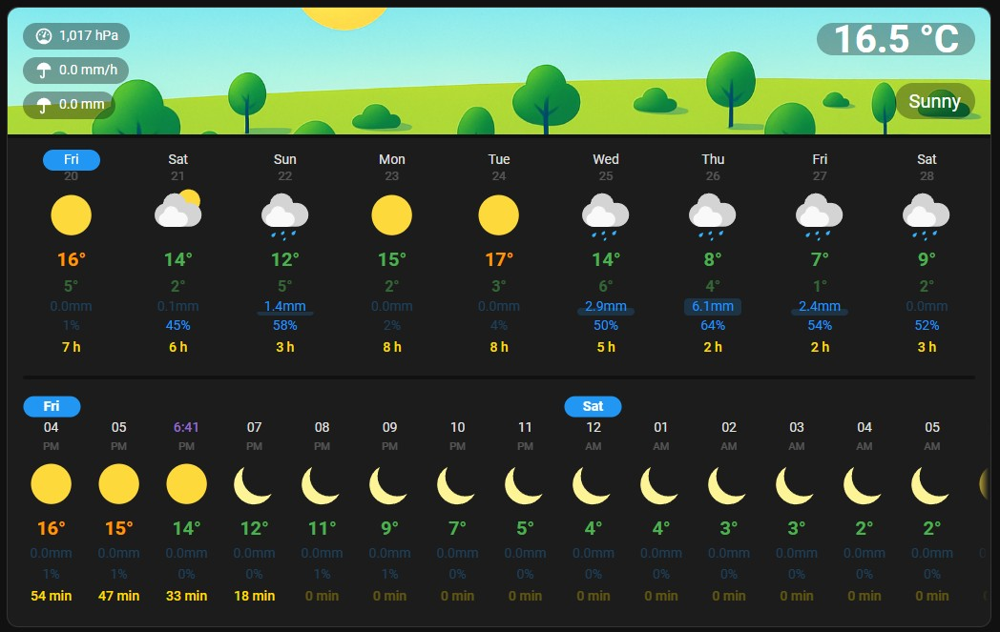
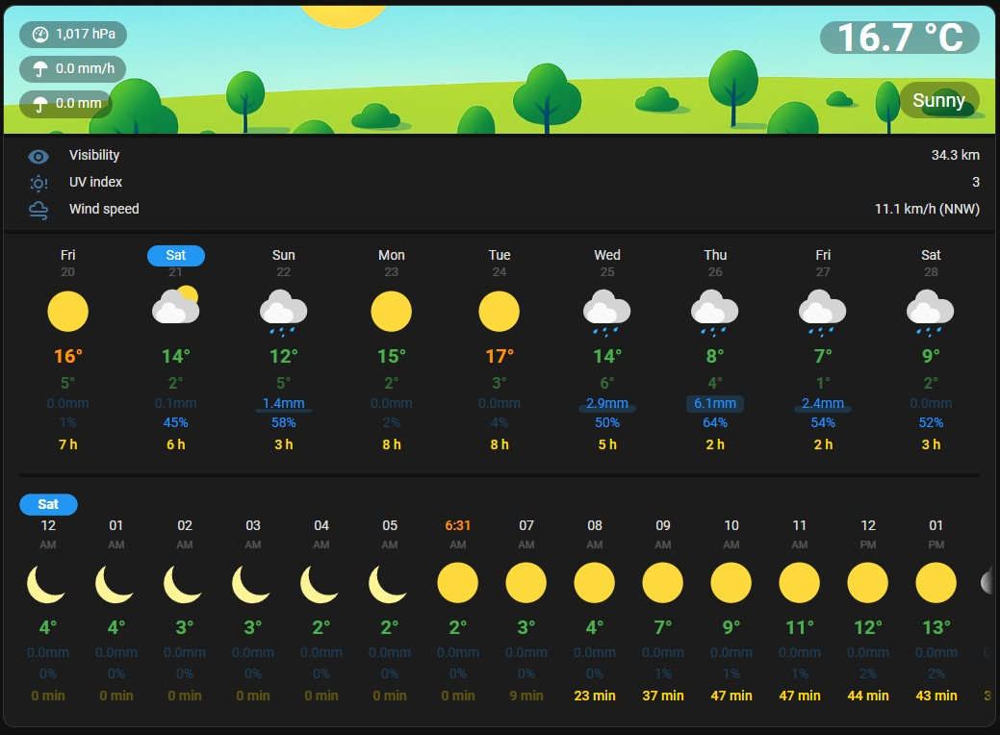
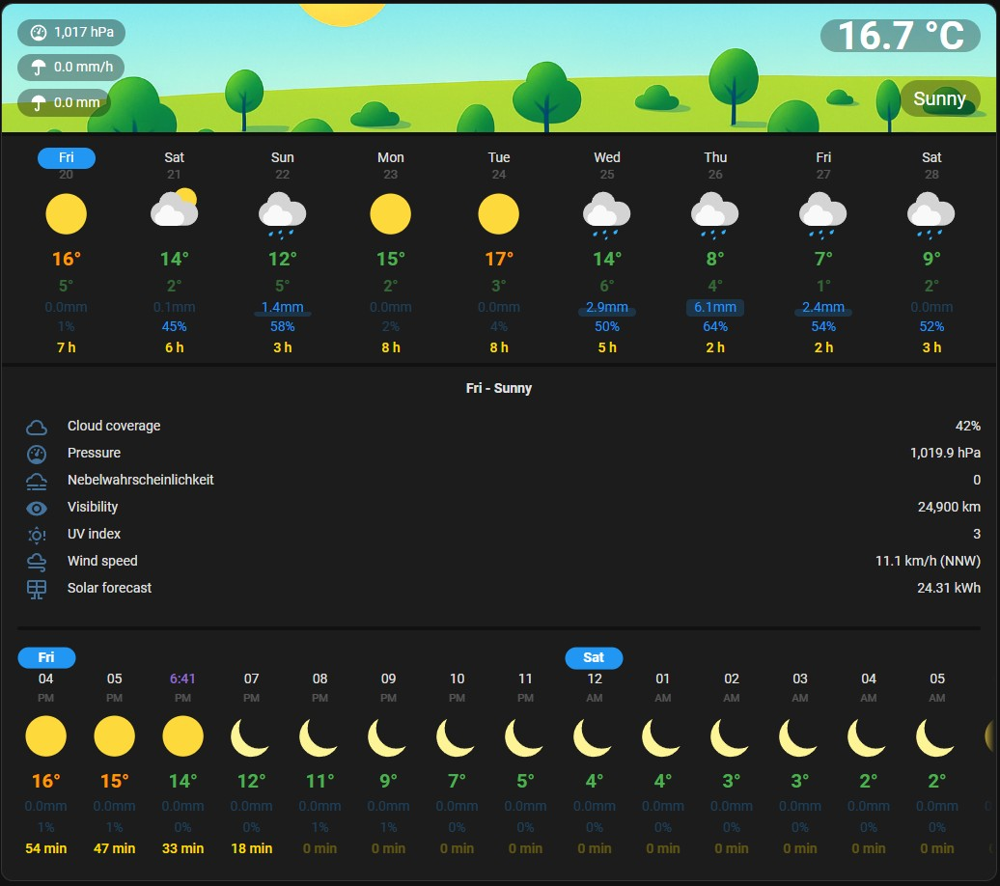
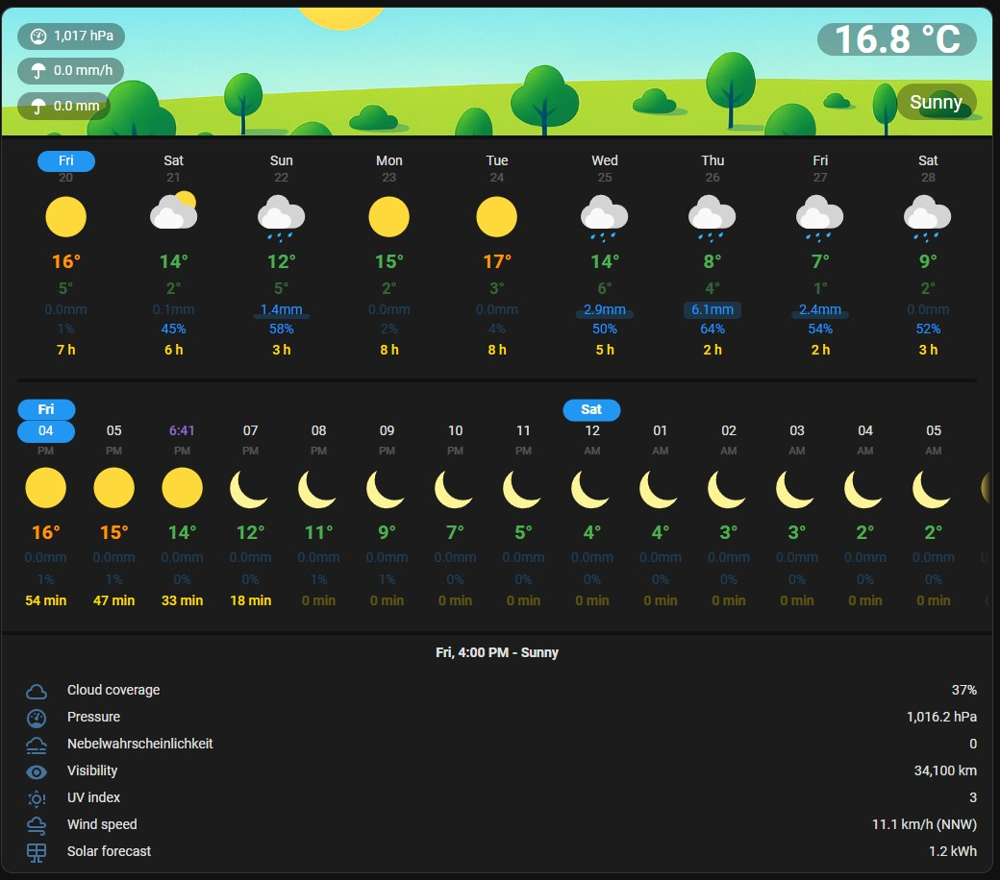
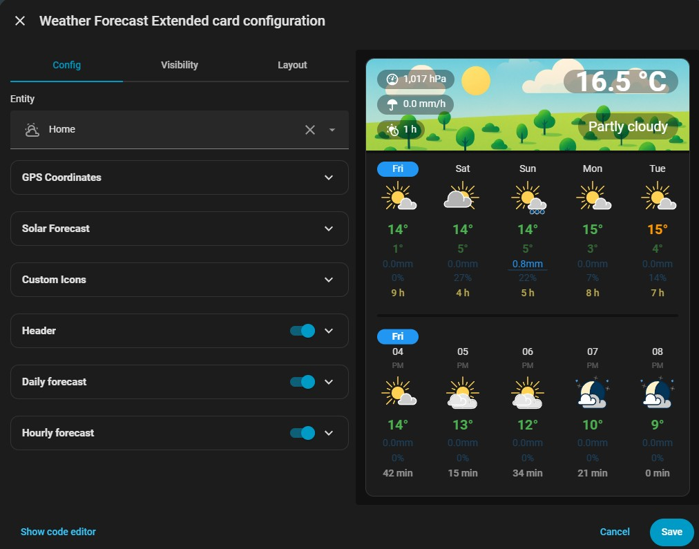

# Detailed Weather Forecast Card











## Overview

Detailed Weather Forecast is a Lovelace custom card for Home Assistant that combines a large weather header with interactive daily and hourly forecasts. The card displays the forecast from the selected `weather` entity, adapts to the dashboard grid, and adds visual context such as sunrise and sunset markers, precipitation values, and day or night specific artwork.

## Features

- Header area that shows the current condition and temperature with day and night background artwork.
- Daily and hourly forecast sections that can be shown together or independently.
- Optional sunrise and sunset times embedded in the hourly forecast, using either the Home Assistant location or custom coordinates for sun calculations.
- Support to display daily / hourly solar forecast.
- Optional minute-level nowcast precipitation chart via `get_minute_forecast` actions (OpenWeatherMap, DWD nowcast).
- Configurable header chips that can display entity attributes or value-templates in the header.
- Optional tap actions and icons on the header pills / chips.
- Support for 12 or 24 hour time formats and localized date labels using the Home Assistant user settings.
- UI card editor

## Installation

### HACS (recommended)

1. In Home Assistant, open _HACS > Frontend_ and click the three-dot menu in the top right.
2. Choose _Custom repositories_, add `https://github.com/tobiasb80/detailed-weather-forecast`, and set the category to _Dashboard_.
3. Search for "Detailed Weather Forecast Card" in HACS, install the latest release, and let HACS add the resource to your dashboard automatically.
4. Reload the browser or clear the Lovelace cache if the new card type is not immediately available.

## Usage

Once the resource is installed, add a new card in the Lovelace dashboard editor and search for **Detailed Weather Forecast**. The visual editor exposes every option listed below. You can also configure the card in YAML:

```yaml
type: custom:detailed-weather-forecast-card
entity: weather.home
```

### Extended example

```yaml
type: custom:weather-forecast-extended-card
show_header: true
hourly_forecast: true
daily_forecast: true
use_night_header_backgrounds: true
nowcast_always_show: false
header_chips:
  - type: attribute
    attribute: humidity
    tap_action:
      action: more-info
  - type: attribute
    attribute: pressure
    tap_action:
      action: more-info
  - type: entity
    entity: sensor.precipitation_today
    tap_action:
      action: more-info
header_temperature_entity: sensor.outdoor_temperatur
show_sun_times: true
hourly_min_gap: '10'
daily_min_gap: '10'
nowcast_entity: weather.dwd_nowcast
entity: weather.home
header_tap_action_temperature:
  action: more-info
daily_extra_attribute: sun_duration
daily_extra_attribute_dim_below: 3600
daily_extra_attribute_color: '#ffdd00'
daily_extra_attribute_unit: h
daily_extra_attribute_divisor: 3600
hourly_extra_attribute: sun_duration
hourly_extra_attribute_color: '#ffdd00'
hourly_extra_attribute_dim_below: 600
hourly_extra_attribute_unit: min
hourly_extra_attribute_divisor: '60'
header_info:
  - type: attribute
    attribute: visibility
    name: ''
  - type: attribute
    attribute: uv_index
    name: ''
  - type: attribute
    attribute: wind_speed
    name: ''
daily_info:
  - attribute: cloud_coverage
    name: ''
  - attribute: pressure
    name: ''
  - attribute: fog_probability
    name: 'Fog probability'
    icon: mdi:weather-fog
  - attribute: visibility
    name: ''
  - attribute: uv_index
    name: ''
  - attribute: wind_speed
    name: ''
  - attribute: solar_forecast
    name: ''
    icon: mdi:solar-panel
    unit: 'kWh '
hourly_info:
  - attribute: cloud_coverage
    name: ''
  - attribute: pressure
    name: ''
  - attribute: fog_probability
    name: 'Fog probability'
    icon: mdi:weather-fog
  - attribute: visibility
    name: ''
  - attribute: uv_index
    name: ''
  - attribute: wind_speed
    name: ''
  - attribute: solar_forecast
    name: ''
    icon: mdi:solar-panel
    unit: kWh
```

## Configuration options

| Option                             | Type                       | Default                                 | Description                                                                                                                                                                                |
| ---------------------------------- | -------------------------- | --------------------------------------- | ------------------------------------------------------------------------------------------------------------------------------------------------------------------------------------------ |
| `type`                             | string                     | `custom:detailed-weather-forecast-card` | Lovelace card type identifier.                                                                                                                                                             |
| `entity`                           | string                     | required                                | Weather entity that supplies current conditions and forecast data.                                                                                                                         |
| `header_temperature_entity`        | string                     | current weather temperature             | Optional sensor to use for the header temperature. Must report a numeric temperature.                                                                                                      |
| `nowcast_entity`                   | string                     | none                                    | Weather entity that supports `get_minute_forecast` and provides minute-level precipitation.                                                                                                |
| `nowcast_always_show`              | boolean                    | `false`                                 | When enabled, the nowcast chart stays visible even if no rain is predicted. Useful to keep the header layout consistent.                                                                   |
| `show_header`                      | boolean                    | `true`                                  | Toggles hero header containing artwork, current temperature, and condition text.                                                                                                           |
| `hourly_forecast`                  | boolean                    | `true`                                  | Shows the hourly forecast. Requires the selected weather entity to provide hourly data.                                                                                                    |
| `daily_forecast`                   | boolean                    | `true`                                  | Shows the daily forecast.                                                                                                                                                                  |
| `daily_min_gap`                    | number                     | `30`                                    | Minimum gap in pixels between daily forecast items. Must be `≥ 10`.                                                                                                                        |
| `hourly_min_gap`                   | number                     | `16`                                    | Minimum gap in pixels between hourly forecast items. Must be `≥ 10`.                                                                                                                       |
| `show_sun_times`                   | boolean                    | `false`                                 | Adds sunrise and sunset markers to the hourly forecast. Requires valid coordinates.                                                                                                        |
| `sun_use_home_coordinates`         | boolean                    | `true`                                  | Uses Home Assistant's home location for sun calculations when `show_sun_times` is enabled. Set to `false` to provide manual coordinates.                                                   |
| `sun_latitude`                     | number \| string           | Home Assistant latitude                 | Latitude used when `sun_use_home_coordinates` is `false`. Accepts decimal degrees as string or number.                                                                                     |
| `sun_longitude`                    | number \| string           | Home Assistant longitude                | Longitude used when `sun_use_home_coordinates` is `false`. Accepts decimal degrees as string or number.                                                                                    |
| `use_night_header_backgrounds`     | boolean                    | `true`                                  | Switches the header artwork to night variants when the sun is down. Set to `false` to always use the day theme.                                                                            |
| `icon_map`                         | object                     | none                                    | Optional overrides for forecast condition icons. Keys are weather conditions, values are Home Assistant icon names (including custom icon sets).                                           |
| `header_tap_action_temperature`    | action                     | none                                    | Lovelace action that fires when the header temperature pill is tapped. Only tap actions are supported.                                                                                     |
| `hourly_extra_attribute`           | string                     | none                                    | Optional third text line under the hourly precipitation rows.                                                                                                                              |
| `hourly_extra_attribute_unit`      | string                     | none                                    | Optional unit suffix displayed after the hourly extra attribute (e.g., `%` for `cloud_coverage`).                                                                                          |
| `hourly_extra_attribute_color`     | string                     | none                                    | Optional CSS color used for the hourly extra attribute text (e.g., `#30b3ff`).                                                                                                             |
| `hourly_extra_attribute_dim_below` | number                     | none                                    | Optional numeric threshold. Values below are displayed with lowered opacity in the hourly extra attribute.                                                                                 |
| `daily_extra_attribute`            | string                     | none                                    | Optional third text line under the daily precipitation rows. `precipitation_probability` shows colored as blue and with a % sign automatically.                                            |
| `daily_extra_attribute_unit`       | string                     | none                                    | Optional unit suffix displayed after the daily extra attribute. Disabled/ignored when `daily_extra_attribute` is `precipitation_probability`.                                              |
| `daily_extra_attribute_color`      | string                     | none                                    | Optional CSS color used for the daily extra attribute text (e.g., `#30b3ff`).                                                                                                              |
| `daily_extra_attribute_dim_below`  | number                     | none                                    | Optional numeric threshold. values below are displayed with lowered opacity in the daily extra attribute.                                                                                  |
| `header_chips`                     | array                      | `[]`                                    | Up to three chip definitions shown in the header. Each chip can display an entity attribute or template output and may include its own `icon` and `tap_action`.                            |
| `header_info`                      | array                      | `[]`                                    | A list of attribute objects to show in the expandable detail view for the current weather conditions.                                                                                      |
| `daily_info`                       | array                      | `[]`                                    | A list of attribute objects to show in the expandable detail view for each daily forecast item.                                                                                            |
| `hourly_info`                      | array                      | `[]`                                    | A list of attribute objects to show in the expandable detail view for each hourly forecast item.                                                                                         |
| `solar_forecast_entries`           | array                      | all Energy solar forecasts              | Optional list of config entry IDs to include when `solar_forecast` is selected as an extra attribute. Leave empty to include none, or omit to include all Energy dashboard selections.     |
| `masonry_rows`                     | number                     | none                                    | Masonry layout only: override the card height (1 row is handled as 50px by HA). Ignored in Sections view.                                                                                  |

> Tip: The card editor prevents you from hiding every section at once, but in YAML you should also keep at least one of `show_header`, `daily_forecast`, or `hourly_forecast` enabled so the card has content to render.

### Header chips

Header chips allow yout to display additional information, such as precipitation probability, feels-like temperature, or other entities. The editor lets you pick between **Attribute** and **Entity** mode for each slot.

```yaml
type: custom:detailed-weather-forecast-card
entity: weather.home
header_chips:
  - type: attribute
    attribute: humidity
    tap_action:
      action: more-info
  - type: attribute
    attribute: pressure
    tap_action:
      action: more-info
  - type: entity
    entity: sensor.precipitation_today
    tap_action:
      action: more-info
```

- `attribute` chips expose an attribute from the configured weather entity. The editor provides a dropdown populated with the entity's attributes.
- `template` chips are rendered by Home Assistant's template engine and can reference any entity.
- Each chip accepts optional `icon` and `tap_action` (tap only).

### Detailed Information Attributes

The `header_info`, `daily_info`, and `hourly_info` options allow you to show more details in an expandable section. When a user clicks the condition text in the header, or a specific forecast item, a list of configured attributes is displayed. This is useful for showing data like cloud coverage, pressure, or UV index.

Each entry in these lists is an object that can contain an `attribute`, a `name` to override the default label, an `icon`, and a `unit`.

```yaml
type: custom:detailed-weather-forecast-card
entity: weather.home
header_info:
  - attribute: visibility
  - attribute: uv_index
  - attribute: wind_speed
daily_info:
  - attribute: cloud_coverage
  - name: 'Fog'
    attribute: fog_probability
    icon: mdi:weather-fog
  - attribute: solar_forecast
    icon: mdi:solar-panel
    unit: 'kWh'
hourly_info:
  - attribute: pressure
  - attribute: wind_gust_speed
    unit: 'km/h'
```

### Custom icons

Override the daily/hourly condition icons with any icon available in Home Assistant (including custom icon packs):

```yaml
type: custom:detailed-weather-forecast-card
entity: weather.home
icon_map:
  sunny: mdi:weather-sunny
  rainy: phu:rainy
  lightning-rainy: mdi:weather-lightning-rainy
```

Supported keys: `clear-night`, `cloudy`, `fog`, `hail`, `lightning`, `lightning-rainy`, `partlycloudy`,
`partlycloudy-night`, `pouring`, `rainy`, `snowy`, `snowy-rainy`, `sunny`, `windy`, `windy-variant`, `exceptional`.

### Daily Extra Attribute

Add a third text row beneath the temperature bar in the daily forecast. Choose any forecast attribute except the built-ins already shown (e.g., datetime, condition, temperature).

```yaml
type: custom:detailed-weather-forecast-card
entity: weather.home
daily_extra_attribute: pressure
daily_extra_attribute_unit: ' hPa'
```

### Hourly Extra Attribute

Add a third text row beneath precipitation and probability in the hourly forecast. Choose any forecast attribute except the built-ins already shown (e.g., datetime, condition, precipitation, precipitation_probability, temperature).

```yaml
type: custom:detailed-weather-forecast-card
entity: weather.home
hourly_extra_attribute: wind_gust_speed
hourly_extra_attribute_unit: ' km/h'
hourly_extra_attribute_color: '#30b3ff'
hourly_extra_attribute_dim_below: 5
```

### Solar forecast extra attribute

If you have a solar forecast configured in the Energy dashboard, you can select `solar_forecast` as the extra attribute for the hourly and/or daily forecast. The card uses the Energy API and sums multiple entries when more than one is selected. Values are shown as kWh.

## Interactions and layout

- Both the daily and hourly forecast sections can be scrolled horizontally. These two sections are synchronized: tapping a day in the daily forecast will scroll the hourly forecast to the corresponding date. Scrolling the hourly forecast will also highlight the correct day in the daily forecast.
- The daily and hourly lists highlights precipitation totals and probabilities above a fixed thresholds.

